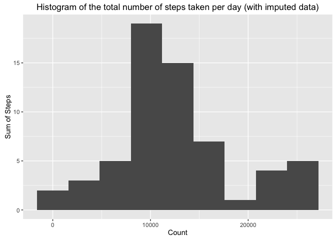

Setting the approriate defaults
-------------------------------

    options(scipen=5)

Loading libraries
-----------------

Load all the libraries that are needed to process the data.

    library(data.table)
    library(ggplot2)
    library(lubridate)
    library(timeDate)
    library(dplyr)
    library(stringr)
    library(Amelia)

Loading and preprocessing the data
----------------------------------

First unzip the data, read in the data and than delete the unzipped
file.

    unzip("activity.zip")
    activity <- read.csv("activity.csv")
    unlink("activity.csv")

Preprocess the data

    activity <- data.table(activity)
    activity$intervalp <- str_pad(activity$interval, 4, pad = "0")
    activity$datetime <- paste(activity$date, activity$intervalp)
    activity$datetime <- ymd_hm(activity$datetime)

What is mean total number of steps taken per day?
-------------------------------------------------

Calculate the total number of steps taken per day.

    grouped <- na.omit(group_by(activity, date))
    sum.per.day <- summarise(grouped, sum.of.steps=sum(steps))
    sum.per.day$date <- ymd(sum.per.day$date)

Make a histogram of the total number of steps taken per day.

    qplot(sum.of.steps, data=sum.per.day, ylab = "Sum of Steps", xlab="Count", main = "Histogram of the total number of steps taken per day", bins="9")

<!-- -->

Calculate the mean of the total number of steps taken per day.

    mean.steps <- mean(sum.per.day$sum.of.steps, na.rm=T)

The mean of the total number of steps taken per day is 10766.1886792.

Calculate the median of the total number of steps taken per day.

    median.steps <- median(sum.per.day$sum.of.steps, na.rm=T)

The median of the total number of steps taken per day is 10765.

What is the average daily activity pattern?
-------------------------------------------

Calculate the average steps per interval.

    average.per.interval <- summarise(group_by(activity, interval), mean.of.steps=mean(steps, na.rm=T))

Make a plot of the average steps per interval.

    qplot(y=average.per.interval$mean.of.steps, x=average.per.interval$interval, data=average.per.interval, geom="path", xlab="Interval", ylab="Average steps per interval", main="Average daily activity pattern")

<!-- -->

Which 5-minute interval, on average across all the days in the dataset,
contains the maximum number of steps?

    # sort the data.table
    max <- average.per.interval[order(-rank(mean.of.steps))]

The 5-minute interval that, on average across all the days in the
dataset, contains the maximum number of steps is 835.

Imputing missing values
-----------------------

Calculate the total number of rows with missing data.

    missing.data <- sum(is.na(activity))

The total number of rows with missing data is 2304.

The missing data is filled using the Amelia package in R.

    # First the bounds need to be set.
    bds <- matrix(c(1, 0, 200), nrow = 1, ncol = 3)

    # Thereafter the imputation needs to run.
    x <- amelia(as.data.frame(activity), m = 1, ts = "datetime", idvars=c("date", "intervalp"), startvals=0, bounds=bds)

Create a new dataset that is equal to the original dataset but with the
missing data filled in.

    imputed.activity <- activity
    imputed.activity$steps <- x$imputations[[1]]$steps

Make a histogram of the total number of steps taken each day.

    imputed.activity.sum <- summarise(group_by(imputed.activity, date), sum.of.steps=sum(steps))

    qplot(sum.of.steps, data=imputed.activity.sum, ylab = "Sum of Steps", xlab="Count", main = "Histogram of the total number of steps taken per day (with imputed data)", bins="9")

<!-- -->

Calculate and report the mean and median total number of steps taken per
day.

    imputed.mean.steps <- mean(imputed.activity.sum$sum.of.steps, na.rm=T)
    imputed.median.steps <- median(imputed.activity.sum$sum.of.steps, na.rm=T)

With the imputed data, the mean of the total number of steps taken per
day is 12561.639468 and the median is 11458.

Do these values differ from the estimates from the first part of the
assignment? What is the impact of imputing missing data on the estimates
of the total daily number of steps?

The difference between the mean and median without imputed data is:

-   mean: 1795.4507887;
-   median: 693.

This means that, when you impute the missing data, the mean and median
is higher.

Are there differences in activity patterns between weekdays and weekends?
-------------------------------------------------------------------------

First seperate the weekdays from the weekends.

    imputed.activity$weekday <- isWeekday(imputed.activity$date, wday=1:5)

    for(i in 1:nrow(imputed.activity)){
            if(as.numeric(imputed.activity$weekday[i])==1){
                    imputed.activity$weekdayb[i] <- "Weekday"
            } else {
                    imputed.activity$weekdayb[i] <- "Weekend"
            }
    }

    weekday.imputed.activity <- subset(imputed.activity, weekdayb=="Weekday")
    weekend.imputed.activity <- subset(imputed.activity, weekdayb=="Weekend")

Calculate the average steps per interval.

    weekday.imputed.interval <- summarise(group_by(weekday.imputed.activity, interval), mean.of.steps=mean(steps, na.rm=T))

    weekday.imputed.interval$weekday <- "Weekday"

    weekend.imputed.interval <- summarise(group_by(weekend.imputed.activity, interval), mean.of.steps=mean(steps, na.rm=T))

    weekend.imputed.interval$weekday <- "Weekend"

    total.imputed.interval <- rbind(weekday.imputed.interval, weekend.imputed.interval)
    total.imputed.interval$weekday <- as.factor(total.imputed.interval$weekday)

Make a panel plot containing a time series plot of the 5-minute interval
(x-axis) and the average number of steps taken, averaged across all
weekday days or weekend days (y-axis)

    qplot(y=mean.of.steps, x=interval, data=total.imputed.interval, xlab="Interval", ylab="Average steps per interval", main="Average daily activity pattern seperated for weekdays and weekends (using imputed data)", facets=weekday~., geom="path")

<!-- -->
